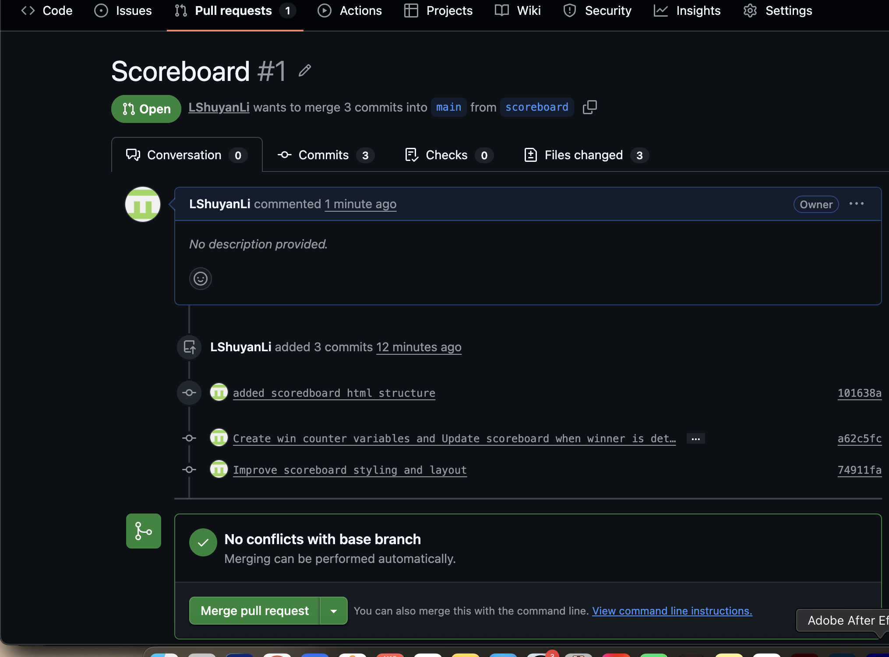

What feature did you implement?
I implemented a scoreboard feature. The game now tracks the total number of wins for both the tortoise and the hare and displays the scores above the track. The scoreboard updates dynamically in the DOM whenever a winner is determined.

## What was the most challenging bug or issue?
The most challenging issue was ensuring that the scoreboard updates correctly when determining the winner, while also maintaining proper race reset behavior between rounds.

My 3 Most Satisfying Commit Messages
- Add scoreboard HTML structure
- Create win counter variables and update the scoreboard when the winner is determined
- Improve scoreboard styling and layout

## Pull Request Screenshot

